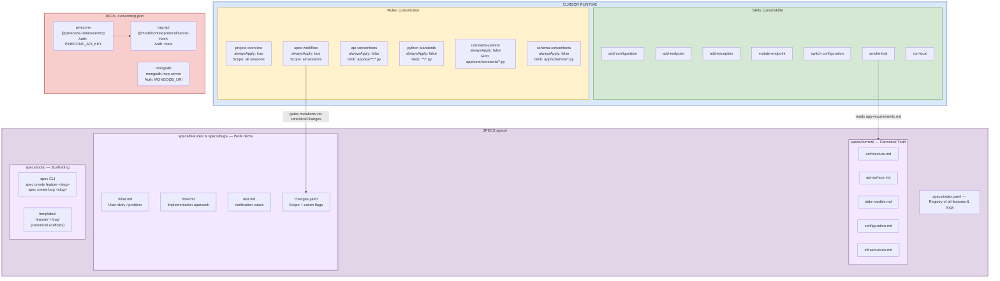
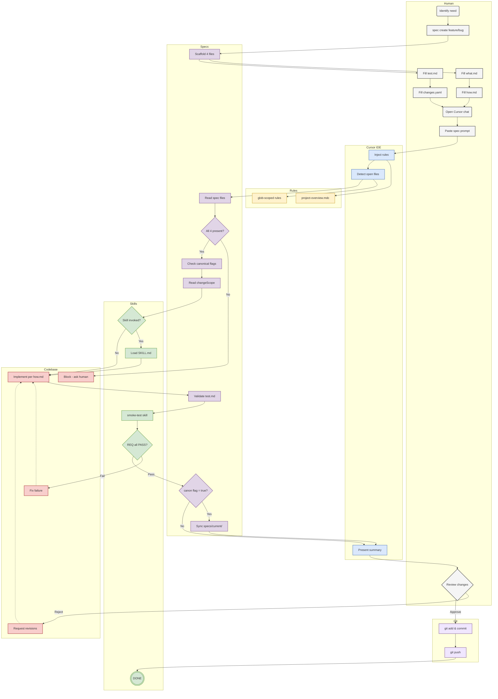

# Contributing

This project uses **spec-driven development**: all non-trivial changes flow through a structured specification pipeline before any code is written. This document explains how that pipeline works.

---

## Core idea

The `specs/` directory is the single source of truth for what the system is and where it is going. Code follows specs — not the other way around. Before implementing a change you write down *what* the end state should look like; after implementing it you update the specs to reflect reality.

---

## Directory layout

```
specs/
├── README.md              ← workflow overview
├── current/               ← live description of the system as it is right now
│   ├── architecture.md    ← stack, service map, request lifecycle
│   ├── api-surface.md     ← all routes, request/response contracts, auth
│   ├── data-models.md     ← enums, Pydantic schemas, domain models
│   ├── configuration.md   ← Settings hierarchy, constants, env vars
│   ├── infrastructure.md  ← Docker, GCP, EC2, CI/CD
│   └── app-requirements.md← REQ-NNN acceptance criteria for smoke tests
├── future/                ← one file per approved or in-flight proposal
│   └── TEMPLATE.md
└── migrations/            ← ordered execution plans (in-progress + complete)
    └── TEMPLATE.md
```

`current/` must be accurate at every commit. Stale specs are worse than no specs.

---

## Workflow for a new change

### 1. Write a future spec

Copy `specs/future/TEMPLATE.md` to `specs/future/<short-slug>.md` and fill in:

- **Motivation** — what problem this solves
- **Desired end state** — concrete description of how the system will look (reference specific files, modules, config values, API contracts)
- **Affected components** — checklist of files that will change
- **Success criteria** — how we know the change is done and correct

Mark the status field as `draft` initially, then `approved` when ready to execute.

### 2. Create a migration doc

Copy `specs/migrations/TEMPLATE.md` to `specs/migrations/YYYYMMDD-<slug>.md`. Fill in:

- **From** — link to the current-spec section being migrated away from
- **To** — link to the future spec
- **Steps** — ordered, checkable list of implementation tasks. The last two steps are always: update `specs/current/` and run smoke tests.
- **Rollback plan** — how to revert if something goes wrong

Do this *before* writing any code.

### 3. Implement

Work through the Steps checklist. Check off each item as you complete it. Do not edit completed steps retroactively — they form a change record.

### 4. Update `specs/current/`

After implementation, update every affected `current/` file to describe the system as it now is. The Cursor rule `spec-sync.mdc` defines exactly which files to touch:

| What changed | File to update |
|---|---|
| Stack, request lifecycle, module responsibilities | `architecture.md` |
| Any route, request/response field, or auth behaviour | `api-surface.md` |
| Any enum, schema, or response shape | `data-models.md` |
| Any constant, Settings field, or default value | `configuration.md` |
| Any environment, CI workflow, or external service | `infrastructure.md` |

If the change introduces or modifies observable API behaviour, add a new `REQ-NNN` entry to `app-requirements.md` following the existing format: `trigger → expected HTTP status → expected body criteria → pass/fail definition`.

### 5. Run smoke tests

```bash
cd smoke_tests && ./run_smoke.sh
```

Evaluate the output against every `REQ-NNN` in `specs/current/app-requirements.md` and record a verdict (`PASS` / `FAIL` / `SKIP`) in the migration doc's verdict table. Do not mark the migration complete if any requirement is `FAIL`.

### 6. Close out

- Set the migration status to `complete` and fill in the `Completed` date.
- Set the future spec status to `superseded`.
- Leave the migration file in place — completed migrations form the project's change history.

---

## Cursor AI agent workflow

The `.cursor/rules/` directory contains rules that instruct the AI agent to follow this workflow automatically:

| Rule file | When it applies |
|---|---|
| `future-execute.mdc` | When you point the agent at a `specs/future/*.md` file and ask it to implement |
| `spec-sync.mdc` | After any implementation — enforces `specs/current/` update + smoke test |
| `project-overview.mdc` | Always active — gives the agent grounded context |
| `api-conventions.mdc` | Always active — FastAPI patterns and route conventions |
| `python-standards.mdc` | Always active — code style and structure |
| `schema-conventions.mdc` | Always active — Pydantic model conventions |
| `constants-pattern.mdc` | Always active — where and how to define constants |

When starting an agent session on a significant change, reference the relevant spec files explicitly:

```
@specs/current/architecture.md @specs/future/my-proposal.md — implement this
```

---

## What belongs in specs vs. other docs

| Location | Purpose |
|---|---|
| `specs/current/` | Architectural truth — what the system is |
| `specs/future/` | Proposals — what the system should become |
| `specs/migrations/` | Execution records — how we got from one state to another |
| `.cursor/rules/` | AI agent instructions — how to write code in this repo |
| `README.md` | Onboarding and operational quick-start |
| `smoke_tests/SPEC.md` | Semantic acceptance criteria for the chat endpoint |
| `scripts/README.md` | Data ingestion script usage |

---

## Diagrams

### Cursor runtime & project structure



### End-to-end spec-driven development workflow



---

## Conventions

- Keep `current/` in sync with the codebase. Update specs in the same commit as the code they describe.
- Prefer links over duplication across spec files.
- One future spec per logical change. Large changes should be broken into sequenced proposals.
- Migration files are write-once — do not edit completed steps.
- If a future spec is abandoned, mark it `superseded` with a note explaining why.
